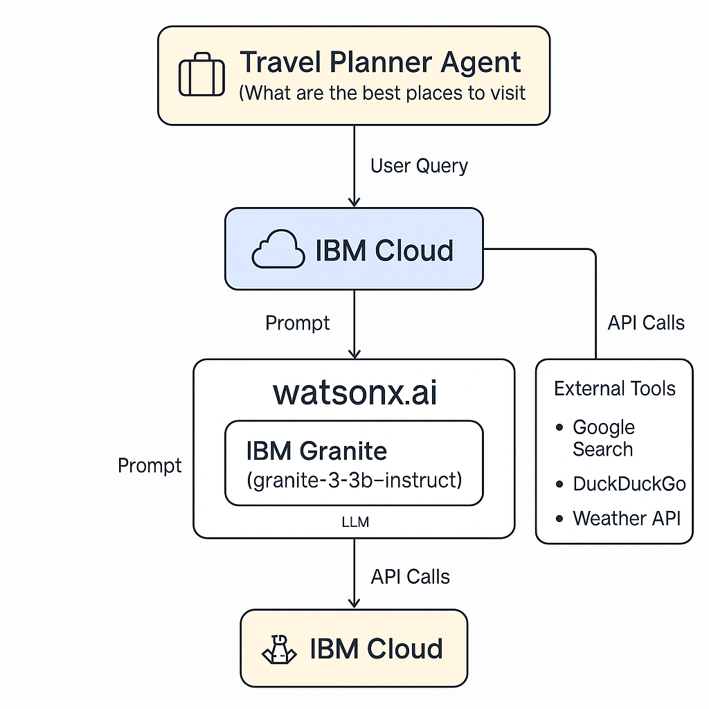

# 🧭 Travel Planner AI Agent

An intelligent travel assistant built using **IBM Watsonx.ai**, **IBM Granite**, and **IBM Cloud**, designed to help users plan personalized trips with ease.

## 🚀 Features
- Suggests destinations based on user preferences, season, and budget
- Generates personalized itineraries
- Recommends transport, food, and accommodations
- Uses RAG + IBM Granite model for natural, real-time responses

## 🧠 Technologies Used
- IBM Granite Foundation Model (`granite-3-3b-instruct`)
- IBM Watsonx.ai Studio & Runtime
- IBM Cloud AgentLab
- Simulated search from Google, DuckDuckGo, RedBus, Goibibo, MakeMyTrip

## 📊 Architecture

## 🙋‍♂️ End Users
- Students, solo travelers, families, working professionals

## 📌 Future Enhancements
- Integrate live booking APIs (RedBus, MakeMyTrip)
- Multilingual support
- Mobile app version

## 📜 License
MIT License 
